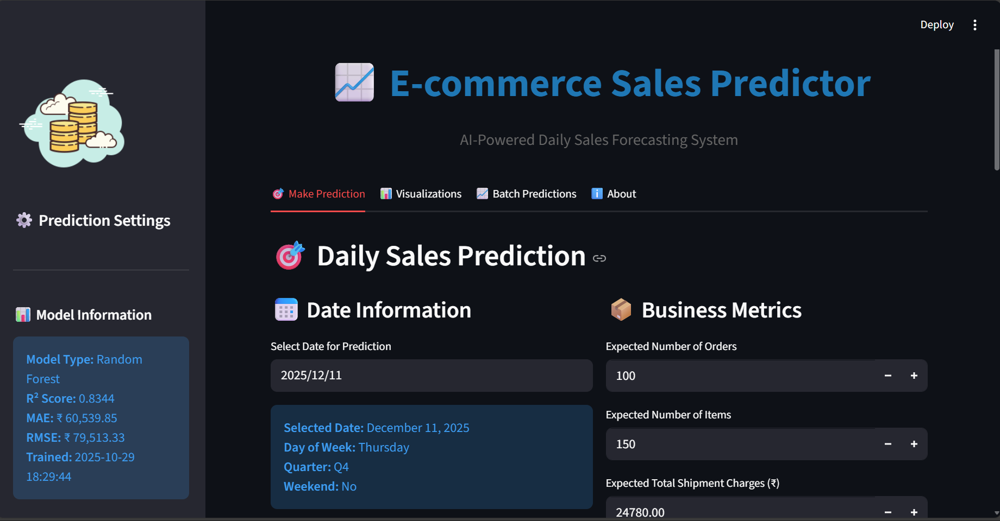
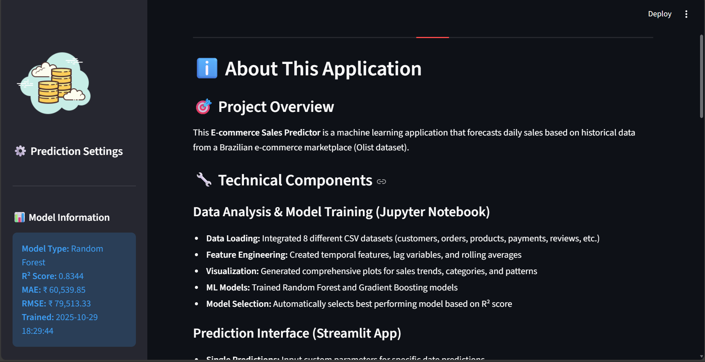
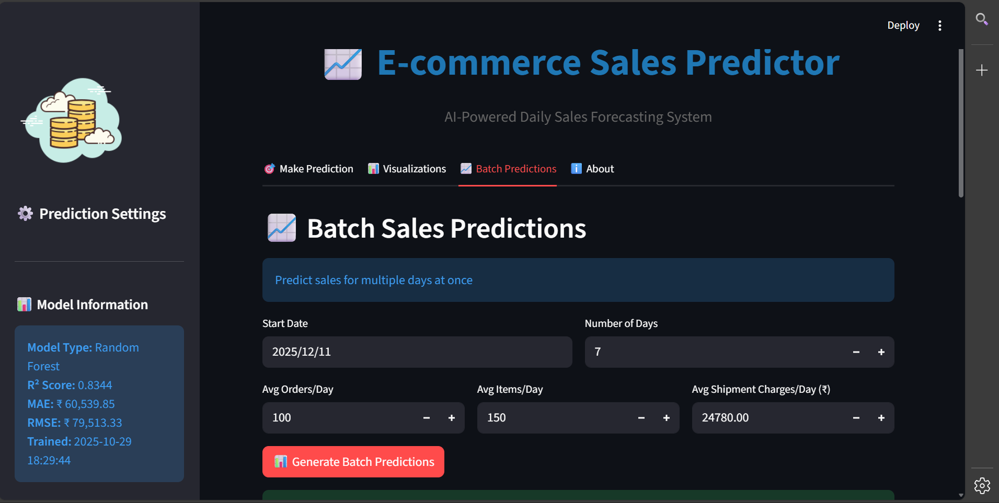
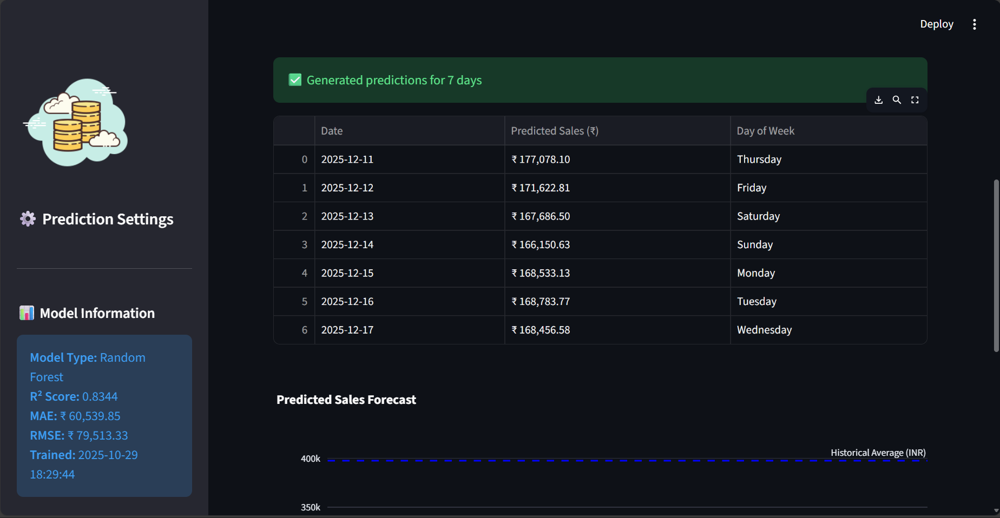
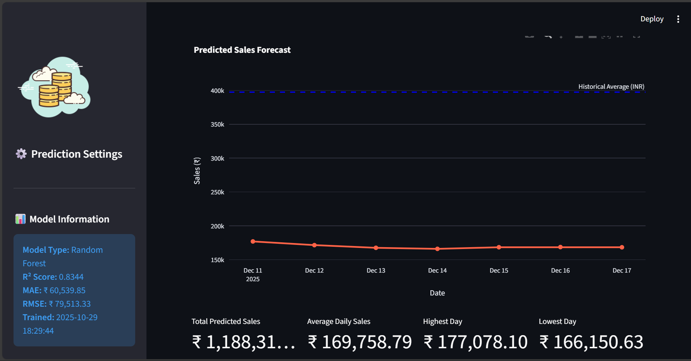
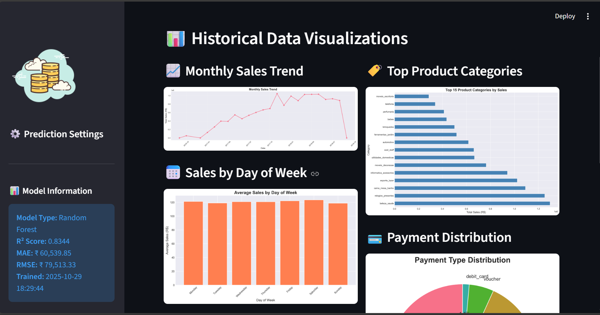
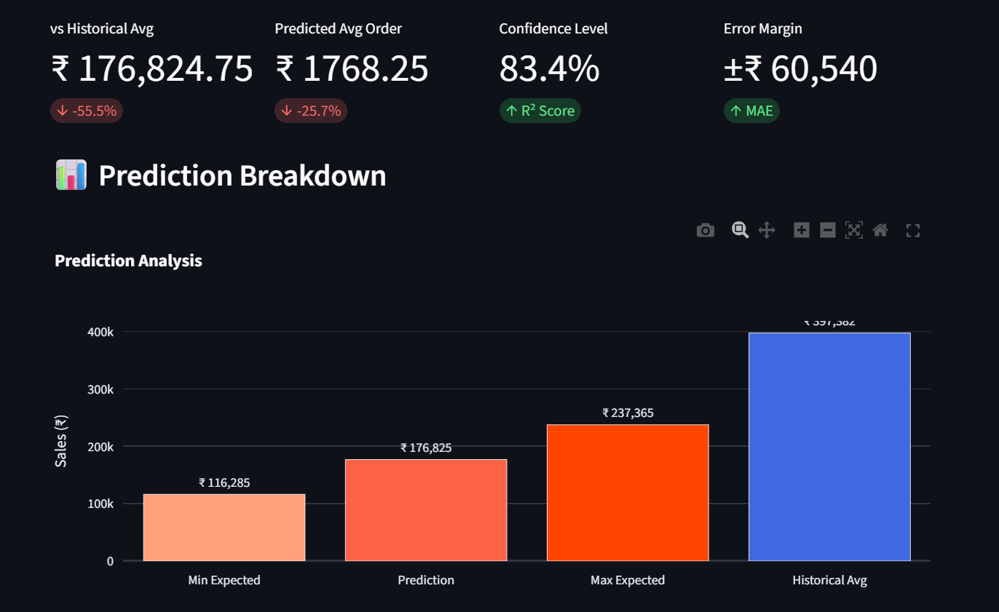

# E-Commerce-Sales-Predictor
A machine learning project that predicts daily e-commerce sales using real marketplace data. Includes advanced feature engineering, model comparison between Random Forest and Gradient Boosting, and a fully interactive Streamlit dashboard with single-day prediction, batch forecasting, and rich visual analytics.

## UI Screenshot

## About Page

## Batch Prediction

## Batch Prediction – Screen 1

## Batch Prediction – Screen 2

## Historical Data Prediction

## Sales Prediction

